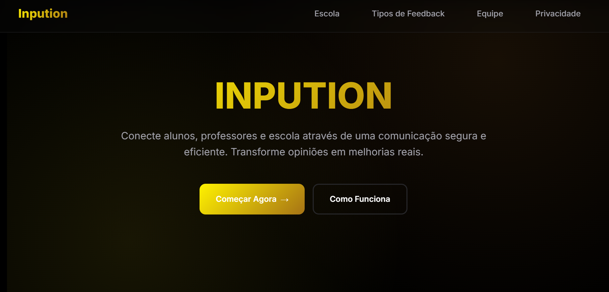

<!DOCTYPE html>
<html lang="pt-BR" class="scroll-smooth">
<head>
    <meta charset="UTF-8">
    <meta name="viewport" content="width=device-width, initial-scale=1.0">
    <title>Portfólio de Projetos dos Alunos</title>
    
    
    
    <link rel="preconnect" href="https://fonts.googleapis.com">
    <link rel="preconnect" href="https://fonts.gstatic.com" crossorigin>
    <link href="https://fonts.googleapis.com/css2?family=Inter:wght@400;500;600;700&display=swap" rel="stylesheet">
    
    

    

</head>
<body class="bg-gray-50 text-gray-800 dark:bg-gray-900 dark:text-gray-200 font-sans antialiased">

    

        <header class="text-center mb-16">
            <h1 class="text-4xl md:text-5xl font-bold text-indigo-600 dark:text-indigo-400 mb-4">Portfólio de Projetos TCC ADS 2025</h1>
            
Vitrine dos projetos de TCC desenvolvidos pelos alunos do curso técnico da E.E. Dr. Alfredo Cardoso.

            
            

                
                

                    
Professora Orientadora

                    

                        Sidinéia Masciarelli
                        <a href="https://www.linkedin.com/in/sidin%C3%A9ia-masciarelli-43198420/" target="_blank" class="text-gray-500 hover:text-indigo-600 transition-colors">
                            <svg xmlns="http://www.w3.org/2000/svg" class="w-5 h-5" fill="currentColor" viewBox="0 0 24 24"><path d="M19 0h-14c-2.761 0-5 2.239-5 5v14c0 2.761 2.239 5 5 5h14c2.762 0 5-2.239 5-5v-14c0-2.761-2.238-5-5-5zm-11 19h-3v-11h3v11zm-1.5-12.268c-.966 0-1.75-.79-1.75-1.764s.784-1.764 1.75-1.764 1.75.79 1.75 1.764-.783 1.764-1.75 1.764zm13.5 12.268h-3v-5.604c0-3.368-4-3.113-4 0v5.604h-3v-11h3v1.765c1.396-2.586 7-2.777 7 2.476v6.759z"/></svg>
                        </a>
                    

                

                

                

                    
Professor Orientador

                    

                        Leonardo Grando
                        <a href="https://www.linkedin.com/in/lgrando123/" target="_blank" class="text-gray-500 hover:text-indigo-600 transition-colors">
                            <svg xmlns="http://www.w3.org/2000/svg" class="w-5 h-5" fill="currentColor" viewBox="0 0 24 24"><path d="M19 0h-14c-2.761 0-5 2.239-5 5v14c0 2.761 2.239 5 5 5h14c2.762 0 5-2.239 5-5v-14c0-2.761-2.238-5-5-5zm-11 19h-3v-11h3v11zm-1.5-12.268c-.966 0-1.75-.79-1.75-1.764s.784-1.764 1.75-1.764 1.75.79 1.75 1.764-.783 1.764-1.75 1.764zm13.5 12.268h-3v-5.604c0-3.368-4-3.113-4 0v5.604h-3v-11h3v1.765c1.396-2.586 7-2.777 7 2.476v6.759z"/></svg>
                        </a>
                    

                

            

        </header>

        <main class="grid grid-cols-1 md:grid-cols-2 xl:grid-cols-4 gap-6 lg:gap-8 mb-16">

            

                
                

                    <h2 class="text-xl font-bold text-indigo-700 dark:text-indigo-300 mb-2">Inpution</h2>
                    

                        INPUTION é uma plataforma de feedback escolar que possibilita aos alunos avaliar, comentar e compartilhar suas opiniões sobre o ambiente de ensino. Com uma interface intuitiva, o site promove uma comunicação mais eficiente.
                    

                    <h3 class="text-sm font-semibold mb-2">Integrantes do Grupo:</h3>
                    <ul class="space-y-1 text-sm text-gray-600 dark:text-gray-300 mb-4">
                        <li class="flex items-center">
                            <svg xmlns="http://www.w3.org/2000/svg" class="w-3 h-3 mr-2 text-gray-500" fill="currentColor" viewBox="0 0 24 24"><path d="M19 0h-14c-2.761 0-5 2.239-5 5v14c0 2.761 2.239 5 5 5h14c2.762 0 5-2.239 5-5v-14c0-2.761-2.238-5-5-5zm-11 19h-3v-11h3v11zm-1.5-12.268c-.966 0-1.75-.79-1.75-1.764s.784-1.764 1.75-1.764 1.75.79 1.75 1.764-.783 1.764-1.75 1.764zm13.5 12.268h-3v-5.604c0-3.368-4-3.113-4 0v5.604h-3v-11h3v1.765c1.396-2.586 7-2.777 7 2.476v6.759z"/></svg>
                            <a href="https://www.linkedin.com/in/flyaway999" target="_blank">Thiago H.</a>
                        </li>
                        <li class="flex items-center">
                            <svg xmlns="http://www.w3.org/2000/svg" class="w-3 h-3 mr-2 text-gray-500" fill="currentColor" viewBox="0 0 24 24"><path d="M19 0h-14c-2.761 0-5 2.239-5 5v14c0 2.761 2.239 5 5 5h14c2.762 0 5-2.239 5-5v-14c0-2.761-2.238-5-5-5zm-11 19h-3v-11h3v11zm-1.5-12.268c-.966 0-1.75-.79-1.75-1.764s.784-1.764 1.75-1.764 1.75.79 1.75 1.764-.783 1.764-1.75 1.764zm13.5 12.268h-3v-5.604c0-3.368-4-3.113-4 0v5.604h-3v-11h3v1.765c1.396-2.586 7-2.777 7 2.476v6.759z"/></svg>
                            <a href="https://www.linkedin.com/in/raissa-caetano-649100370" target="_blank">Raissa C.</a>
                        </li>
                        <li class="flex items-center pl-5">
                            Hawan
                        </li>
                        <li class="flex items-center pl-5">
                            Gustavo M.
                        </li>
                        <li class="flex items-center pl-5">
                            Pedro H.
                        </li>
                    </ul>
                    

                        <a href="https://flyaway999.github.io/inpution2/home-page/index.html" target="_blank" class="inline-flex items-center justify-center w-full px-4 py-2 bg-indigo-600 text-white font-semibold rounded-lg shadow-md hover:bg-indigo-700 focus:outline-none focus:ring-2 focus:ring-indigo-500 focus:ring-offset-2 transition-colors duration-200 text-sm">
                            Ver Projeto
                            <svg class="w-4 h-4 ml-2" fill="none" stroke="currentColor" viewBox="0 0 24 24" xmlns="http://www.w3.org/2000/svg"><path stroke-linecap="round" stroke-linejoin="round" stroke-width="2" d="M10 6H6a2 2 0 00-2 2v10a2 2 0 002 2h10a2 2 0 002-2v-4M14 4h6m0 0v6m0-6L10 14"></path></svg>
                        </a>
                        <a href="https://github.com/flyaway999/inpution2" target="_blank" class="inline-flex items-center justify-center w-full px-4 py-2 bg-indigo-200 text-white font-semibold rounded-lg shadow-md hover:bg-indigo-700 focus:outline-none focus:ring-2 focus:ring-indigo-500 focus:ring-offset-2 transition-colors duration-200 mt-2 text-sm">
                            Repositório
                            <svg class="w-4 h-4 ml-2" fill="none" stroke="currentColor" viewBox="0 0 24 24" xmlns="http://www.w3.org/2000/svg"><path stroke-linecap="round" stroke-linejoin="round" stroke-width="2" d="M10 6H6a2 2 0 00-2 2v10a2 2 0 002 2h10a2 2 0 002-2v-4M14 4h6m0 0v6m0-6L10 14"></path></svg>
                        </a>
                    

                

            

            

                
                

                    <h2 class="text-xl font-bold text-emerald-700 dark:text-emerald-300 mb-2">Site Web E.E. Alfredo Cardoso</h2>
                    

                        Proposta de Website para a E.E. Dr. Alfredo Cardoso.
                    

                    <h3 class="text-sm font-semibold mb-2">Integrantes do Grupo:</h3>
                    <ul class="space-y-1 text-sm text-gray-600 dark:text-gray-300 mb-4">
                        <li class="flex items-center pl-5">
                            Rai Oliveira Pereira
                        </li>
                        <li class="flex items-center">
                            <svg xmlns="http://www.w3.org/2000/svg" class="w-3 h-3 mr-2 text-gray-500" fill="currentColor" viewBox="0 0 24 24"><path d="M19 0h-14c-2.761 0-5 2.239-5 5v14c0 2.761 2.239 5 5 5h14c2.762 0 5-2.239 5-5v-14c0-2.761-2.238-5-5-5zm-11 19h-3v-11h3v11zm-1.5-12.268c-.966 0-1.75-.79-1.75-1.764s.784-1.764 1.75-1.764 1.75.79 1.75 1.764-.783 1.764-1.75 1.764zm13.5 12.268h-3v-5.604c0-3.368-4-3.113-4 0v5.604h-3v-11h3v1.765c1.396-2.586 7-2.777 7 2.476v6.759z"/></svg>
                            <a href="https://br.linkedin.com/in/guilhermediasmota07" target="_blank" class="hover:text-emerald-500 dark:hover:text-emerald-400 hover:underline">Guilherme</a>
                        </li>
                        <li class="flex items-center">
                            <svg xmlns="http://www.w3.org/2000/svg" class="w-3 h-3 mr-2 text-gray-500" fill="currentColor" viewBox="0 0 24 24"><path d="M19 0h-14c-2.761 0-5 2.239-5 5v14c0 2.761 2.239 5 5 5h14c2.762 0 5-2.239 5-5v-14c0-2.761-2.238-5-5-5zm-11 19h-3v-11h3v11zm-1.5-12.268c-.966 0-1.75-.79-1.75-1.764s.784-1.764 1.75-1.764 1.75.79 1.75 1.764-.783 1.764-1.75 1.764zm13.5 12.268h-3v-5.604c0-3.368-4-3.113-4 0v5.604h-3v-11h3v1.765c1.396-2.586 7-2.777 7 2.476v6.759z"/></svg>
                            <a href="https://www.linkedin.com/in/iarley-ramos-872037398?utm_source=share_via&utm_content=profile&utm_medium=member_ios" target="_blank" class="hover:text-emerald-500 dark:hover:text-emerald-400 hover:underline">Iarley</a>
                        </li>
                    </ul>
                    

                        <a href="https://olukyr.github.io/web-site-do-cardoso/" target="_blank" class="inline-flex items-center justify-center w-full px-4 py-2 bg-emerald-500 text-white font-semibold rounded-lg shadow-md hover:bg-emerald-600 focus:outline-none focus:ring-2 focus:ring-emerald-500 focus:ring-offset-2 transition-colors duration-200 text-sm">
                            Ver Projeto
                            <svg class="w-4 h-4 ml-2" fill="none" stroke="currentColor" viewBox="0 0 24 24" xmlns="http://www.w3.org/2000/svg"><path stroke-linecap="round" stroke-linejoin="round" stroke-width="2" d="M10 6H6a2 2 0 00-2 2v10a2 2 0 002 2h10a2 2 0 002-2v-4M14 4h6m0 0v6m0-6L10 14"></path></svg>
                        </a>
                        <a href="https://github.com/Olukyr/web-site-do-cardoso" target="_blank" class="inline-flex items-center justify-center w-full px-4 py-2 bg-indigo-200 text-white font-semibold rounded-lg shadow-md hover:bg-indigo-700 focus:outline-none focus:ring-2 focus:ring-indigo-500 focus:ring-offset-2 transition-colors duration-200 mt-2 text-sm">
                            Repositório
                            <svg class="w-4 h-4 ml-2" fill="none" stroke="currentColor" viewBox="0 0 24 24" xmlns="http://www.w3.org/2000/svg"><path stroke-linecap="round" stroke-linejoin="round" stroke-width="2" d="M10 6H6a2 2 0 00-2 2v10a2 2 0 002 2h10a2 2 0 002-2v-4M14 4h6m0 0v6m0-6L10 14"></path></svg>
                        </a>
                        

                

            

            

                
                

                    <h2 class="text-xl font-bold text-amber-700 dark:text-amber-300 mb-2">Biblioteca Escolar</h2>
                    

                        Projeto de TCC para o gerenciamento dos livros presentes na biblioteca da E.E. Dr. Alfredo Cardoso.
                    

                    <h3 class="text-sm font-semibold mb-2">Integrantes do Grupo</h3>
                    <ul class="space-y-1 text-sm text-gray-600 dark:text-gray-300 mb-4">
                        <li class="flex items-center">
                            <svg xmlns="http://www.w3.org/2000/svg" class="w-3 h-3 mr-2 text-gray-500" fill="currentColor" viewBox="0 0 24 24"><path d="M19 0h-14c-2.761 0-5 2.239-5 5v14c0 2.761 2.239 5 5 5h14c2.762 0 5-2.239 5-5v-14c0-2.761-2.238-5-5-5zm-11 19h-3v-11h3v11zm-1.5-12.268c-.966 0-1.75-.79-1.75-1.764s.784-1.764 1.75-1.764 1.75.79 1.75 1.764-.783 1.764-1.75 1.764zm13.5 12.268h-3v-5.604c0-3.368-4-3.113-4 0v5.604h-3v-11h3v1.765c1.396-2.586 7-2.777 7 2.476v6.759z"/></svg>
                            <a href="https://www.linkedin.com/in/ana-clara-calixto-da-silva-38a816377?utm_source=share&utm_campaign=share_via&utm_content=profile&utm_medium=ios_app" target="_blank" class="hover:text-amber-500 dark:hover:text-amber-400 hover:underline">Ana Clara Calixto</a>
                        </li>
                        <li class="flex items-center">
                            <svg xmlns="http://www.w3.org/2000/svg" class="w-3 h-3 mr-2 text-gray-500" fill="currentColor" viewBox="0 0 24 24"><path d="M19 0h-14c-2.761 0-5 2.239-5 5v14c0 2.761 2.239 5 5 5h14c2.762 0 5-2.239 5-5v-14c0-2.761-2.238-5-5-5zm-11 19h-3v-11h3v11zm-1.5-12.268c-.966 0-1.75-.79-1.75-1.764s.784-1.764 1.75-1.764 1.75.79 1.75 1.764-.783 1.764-1.75 1.764zm13.5 12.268h-3v-5.604c0-3.368-4-3.113-4 0v5.604h-3v-11h3v1.765c1.396-2.586 7-2.777 7 2.476v6.759z"/></svg>
                            <a href="https://www.linkedin.com/in/giovana-ribeiro-7a7414327?utm_source=share&utm_campaign=share_via&utm_content=profile&utm_medium=android_app" target="_blank" class="hover:text-amber-500 dark:hover:text-amber-400 hover:underline">Giovana Ribeiro Gomes</a>
                        </li>
                        <li class="flex items-center pl-5">
                            Mellody Costa Camargo Maia
                        </li>
                        <li class="flex items-center">
                            <svg xmlns="http://www.w3.org/2000/svg" class="w-3 h-3 mr-2 text-gray-500" fill="currentColor" viewBox="0 0 24 24"><path d="M19 0h-14c-2.761 0-5 2.239-5 5v14c0 2.761 2.239 5 5 5h14c2.762 0 5-2.239 5-5v-14c0-2.761-2.238-5-5-5zm-11 19h-3v-11h3v11zm-1.5-12.268c-.966 0-1.75-.79-1.75-1.764s.784-1.764 1.75-1.764 1.75.79 1.75 1.764-.783 1.764-1.75 1.764zm13.5 12.268h-3v-5.604c0-3.368-4-3.113-4 0v5.604h-3v-11h3v1.765c1.396-2.586 7-2.777 7 2.476v6.759z"/></svg>
                            <a href="https://www.linkedin.com/in/diego-crucillo-826823352?utm_source=share_via&utm_content=profile&utm_medium=member_android" target="_blank" class="hover:text-amber-500 dark:hover:text-amber-400 hover:underline">Diego Crucillo Zaramella</a>
                        </li>
                        <li class="flex items-center">
                            <svg xmlns="http://www.w3.org/2000/svg" class="w-3 h-3 mr-2 text-gray-500" fill="currentColor" viewBox="0 0 24 24"><path d="M19 0h-14c-2.761 0-5 2.239-5 5v14c0 2.761 2.239 5 5 5h14c2.762 0 5-2.239 5-5v-14c0-2.761-2.238-5-5-5zm-11 19h-3v-11h3v11zm-1.5-12.268c-.966 0-1.75-.79-1.75-1.764s.784-1.764 1.75-1.764 1.75.79 1.75 1.764-.783 1.764-1.75 1.764zm13.5 12.268h-3v-5.604c0-3.368-4-3.113-4 0v5.604h-3v-11h3v1.765c1.396-2.586 7-2.777 7 2.476v6.759z"/></svg>
                            <a href="https://www.linkedin.com/in/jerceane-santos-queiroz-28841b377?utm_source=share&utm_campaign=share_via&utm_content=profile&utm_medium=android_app" target="_blank" class="hover:text-amber-500 dark:hover:text-amber-400 hover:underline">Jerceane Santos Queiroz</a>
                        </li>
                        <li class="flex items-center">
                            <svg xmlns="http://www.w3.org/2000/svg" class="w-3 h-3 mr-2 text-gray-500" fill="currentColor" viewBox="0 0 24 24"><path d="M19 0h-14c-2.761 0-5 2.239-5 5v14c0 2.761 2.239 5 5 5h14c2.762 0 5-2.239 5-5v-14c0-2.761-2.238-5-5-5zm-11 19h-3v-11h3v11zm-1.5-12.268c-.966 0-1.75-.79-1.75-1.764s.784-1.764 1.75-1.764 1.75.79 1.75 1.764-.783 1.764-1.75 1.764zm13.5 12.268h-3v-5.604c0-3.368-4-3.113-4 0v5.604h-3v-11h3v1.765c1.396-2.586 7-2.777 7 2.476v6.759z"/></svg>
                            <a href="https://www.linkedin.com/in/gleiciellen-moura-de-ara%C3%BAjo-ara%C3%BAjo-052996392?utm_source=share&utm_campaign=share_via&utm_content=profile&utm_medium=android_app" target="_blank" class="hover:text-amber-500 dark:hover:text-amber-400 hover:underline">Gleiciellen</a>
                        </li>
                    </ul>
                    

                        <a href="https://github.com/giovanaribeir/biblioteca-alfredo-cardoso" target="_blank" class="inline-flex items-center justify-center w-full px-4 py-2 bg-indigo-200 text-white font-semibold rounded-lg shadow-md hover:bg-indigo-700 focus:outline-none focus:ring-2 focus:ring-indigo-500 focus:ring-offset-2 transition-colors duration-200 mt-2 text-sm">
                            Repositório
                            <svg class="w-4 h-4 ml-2" fill="none" stroke="currentColor" viewBox="0 0 24 24" xmlns="http://www.w3.org/2000/svg"><path stroke-linecap="round" stroke-linejoin="round" stroke-width="2" d="M10 6H6a2 2 0 00-2 2v10a2 2 0 002 2h10a2 2 0 002-2v-4M14 4h6m0 0v6m0-6L10 14"></path></svg>
                        </a>
                        

                

            

            

                
                

                    <h2 class="text-xl font-bold text-red-700 dark:text-red-300 mb-2">EduFox</h2>
                    

                        O EduFox é um aplicativo desenvolvido em Android Studio para modernizar a gestão escolar, substituindo registros em papel por um sistema digital. Ele permite o registro e controle ágil de ocorrências.
                    

                    <h3 class="text-sm font-semibold mb-2">Integrantes do Grupo:</h3>
                    <ul class="space-y-1 text-sm text-gray-600 dark:text-gray-300 mb-4">
                        <li class="flex items-center">
                            <svg xmlns="http://www.w3.org/2000/svg" class="w-3 h-3 mr-2 text-gray-500" fill="currentColor" viewBox="0 0 24 24"><path d="M19 0h-14c-2.761 0-5 2.239-5 5v14c0 2.761 2.239 5 5 5h14c2.762 0 5-2.239 5-5v-14c0-2.761-2.238-5-5-5zm-11 19h-3v-11h3v11zm-1.5-12.268c-.966 0-1.75-.79-1.75-1.764s.784-1.764 1.75-1.764 1.75.79 1.75 1.764-.783 1.764-1.75 1.764zm13.5 12.268h-3v-5.604c0-3.368-4-3.113-4 0v5.604h-3v-11h3v1.765c1.396-2.586 7-2.777 7 2.476v6.759z"/></svg>
                            <a href="https://www.linkedin.com/in/millena-rocha-rando-a30761376/" target="_blank" class="hover:text-red-500 dark:hover:text-red-400 hover:underline">Millena Rocha Rando</a>
                        </li>
                        <li class="flex items-center">
                            <svg xmlns="http://www.w3.org/2000/svg" class="w-3 h-3 mr-2 text-gray-500" fill="currentColor" viewBox="0 0 24 24"><path d="M19 0h-14c-2.761 0-5 2.239-5 5v14c0 2.761 2.239 5 5 5h14c2.762 0 5-2.239 5-5v-14c0-2.761-2.238-5-5-5zm-11 19h-3v-11h3v11zm-1.5-12.268c-.966 0-1.75-.79-1.75-1.764s.784-1.764 1.75-1.764 1.75.79 1.75 1.764-.783 1.764-1.75 1.764zm13.5 12.268h-3v-5.604c0-3.368-4-3.113-4 0v5.604h-3v-11h3v1.765c1.396-2.586 7-2.777 7 2.476v6.759z"/></svg>
                            <a href="https://www.linkedin.com/in/gabrielle-merches-2a7420348?utm_source=share&utm_campaign=share_via&utm_content=profile&utm_medium=android_app" target="_blank" class="hover:text-red-500 dark:hover:text-red-400 hover:underline">Gabrielle Merches Alves</a>
                        </li>
                        
                        
                        <li class="flex items-center">
                            <svg xmlns="http://www.w3.org/2000/svg" class="w-3 h-3 mr-2 text-gray-500" fill="currentColor" viewBox="0 0 24 24"><path d="M19 0h-14c-2.761 0-5 2.239-5 5v14c0 2.761 2.239 5 5 5h14c2.762 0 5-2.239 5-5v-14c0-2.761-2.238-5-5-5zm-11 19h-3v-11h3v11zm-1.5-12.268c-.966 0-1.75-.79-1.75-1.764s.784-1.764 1.75-1.764 1.75.79 1.75 1.764-.783 1.764-1.75 1.764zm13.5 12.268h-3v-5.604c0-3.368-4-3.113-4 0v5.604h-3v-11h3v1.765c1.396-2.586 7-2.777 7 2.476v6.759z"/></svg>
                            <a href="https://br.linkedin.com/in/wyverson-bueno-0b1977392" target="_blank" class="hover:text-red-500 dark:hover:text-red-400 hover:underline">Wyverson Anthony Bueno</a>
                        </li>
                        
                        <li class="flex items-center">
                            <svg xmlns="http://www.w3.org/2000/svg" class="w-3 h-3 mr-2 text-gray-500" fill="currentColor" viewBox="0 0 24 24"><path d="M19 0h-14c-2.761 0-5 2.239-5 5v14c0 2.761 2.239 5 5 5h14c2.762 0 5-2.239 5-5v-14c0-2.761-2.238-5-5-5zm-11 19h-3v-11h3v11zm-1.5-12.268c-.966 0-1.75-.79-1.75-1.764s.784-1.764 1.75-1.764 1.75.79 1.75 1.764-.783 1.764-1.75 1.764zm13.5 12.268h-3v-5.604c0-3.368-4-3.113-4 0v5.604h-3v-11h3v1.765c1.396-2.586 7-2.777 7 2.476v6.759z"/></svg>
                            <a href="https://www.linkedin.com/in/null-qaq-2ab09639b?utm_source=share&utm_campaign=share_via&utm_content=profile&utm_medium=android_app" target="_blank" class="hover:text-red-500 dark:hover:text-red-400 hover:underline">Murilo Thales Marcelino</a>
                        </li>
                    </ul>
                    

                        <a href="https://tccocorrencia.vercel.app/" target="_blank" class="inline-flex items-center justify-center w-full px-4 py-2 bg-red-500 text-white font-semibold rounded-lg shadow-md hover:bg-red-600 focus:outline-none focus:ring-2 focus:ring-red-500 focus:ring-offset-2 transition-colors duration-200 text-sm">
                            Ver Projeto
                            <svg class="w-4 h-4 ml-2" fill="none" stroke="currentColor" viewBox="0 0 24 24" xmlns="http://www.w3.org/2000/svg"><path stroke-linecap="round" stroke-linejoin="round" stroke-width="2" d="M10 6H6a2 2 0 00-2 2v10a2 2 0 002 2h10a2 2 0 002-2v-4M14 4h6m0 0v6m0-6L10 14"></path></svg>
                        </a>
                        <a href="https://github.com/mih-ter/tcc_ocorrencia-" target="_blank" class="inline-flex items-center justify-center w-full px-4 py-2 bg-indigo-200 text-white font-semibold rounded-lg shadow-md hover:bg-indigo-700 focus:outline-none focus:ring-2 focus:ring-indigo-500 focus:ring-offset-2 transition-colors duration-200 mt-2 text-sm">
                            Repositório
                            <svg class="w-4 h-4 ml-2" fill="none" stroke="currentColor" viewBox="0 0 24 24" xmlns="http://www.w3.org/2000/svg"><path stroke-linecap="round" stroke-linejoin="round" stroke-width="2" d="M10 6H6a2 2 0 00-2 2v10a2 2 0 002 2h10a2 2 0 002-2v-4M14 4h6m0 0v6m0-6L10 14"></path></svg>
                        </a>
                        

                

            

        </main>
        
        <section class="max-w-6xl mx-auto mb-16 bg-white dark:bg-gray-800 p-8 rounded-xl shadow-lg border border-gray-200 dark:border-gray-700">
            

                <h3 class="text-2xl font-bold text-gray-800 dark:text-white mb-2">Muito Além do Código</h3>
                

                    O desenvolvimento destes projetos envolveu uma imersão completa em práticas reais do mercado de tecnologia.
                

            

            
            

                
                

                    

                        <svg class="w-6 h-6 text-green-500" fill="none" stroke="currentColor" viewBox="0 0 24 24"><path stroke-linecap="round" stroke-linejoin="round" stroke-width="2" d="M5 13l4 4L19 7"></path></svg>
                    

                    

                        Versionamento
                        Git e GitHub profissional.
                    

                

                

                    

                        <svg class="w-6 h-6 text-green-500" fill="none" stroke="currentColor" viewBox="0 0 24 24"><path stroke-linecap="round" stroke-linejoin="round" stroke-width="2" d="M5 13l4 4L19 7"></path></svg>
                    

                    

                        Vibe Coding & IA
                        Fluxo assistido por IA.
                    

                

                

                    

                        <svg class="w-6 h-6 text-green-500" fill="none" stroke="currentColor" viewBox="0 0 24 24"><path stroke-linecap="round" stroke-linejoin="round" stroke-width="2" d="M5 13l4 4L19 7"></path></svg>
                    

                    

                        Soft Skills & Resiliência
                        Colaboração e adaptação.
                    

                

                

                    

                        <svg class="w-6 h-6 text-green-500" fill="none" stroke="currentColor" viewBox="0 0 24 24"><path stroke-linecap="round" stroke-linejoin="round" stroke-width="2" d="M5 13l4 4L19 7"></path></svg>
                    

                    

                        Desenvolvimento Full Stack
                        Front-end e Back-end.
                    

                

                

                    

                        <svg class="w-6 h-6 text-green-500" fill="none" stroke="currentColor" viewBox="0 0 24 24"><path stroke-linecap="round" stroke-linejoin="round" stroke-width="2" d="M5 13l4 4L19 7"></path></svg>
                    

                    

                        Banco de Dados
                        Modelagem e SQL.
                    

                

                

                    

                        <svg class="w-6 h-6 text-green-500" fill="none" stroke="currentColor" viewBox="0 0 24 24"><path stroke-linecap="round" stroke-linejoin="round" stroke-width="2" d="M5 13l4 4L19 7"></path></svg>
                    

                    

                        Mobile Dev
                        Apps Android nativos.
                    

                

                

                    

                        <svg class="w-6 h-6 text-green-500" fill="none" stroke="currentColor" viewBox="0 0 24 24"><path stroke-linecap="round" stroke-linejoin="round" stroke-width="2" d="M5 13l4 4L19 7"></path></svg>
                    

                    

                        Responsabilidade
                        Compromisso com entregas.
                    

                

                

                    

                        <svg class="w-6 h-6 text-green-500" fill="none" stroke="currentColor" viewBox="0 0 24 24"><path stroke-linecap="round" stroke-linejoin="round" stroke-width="2" d="M5 13l4 4L19 7"></path></svg>
                    

                    

                        Marketing Pessoal
                        LinkedIn e Portfólio.
                    

                

            

        </section>

        <footer class="text-center mt-16 text-gray-500 dark:text-gray-400">
            
&copy; 2025 - Feito com ❤️ pelos alunos.

        </footer>

    

</body>
</html>
